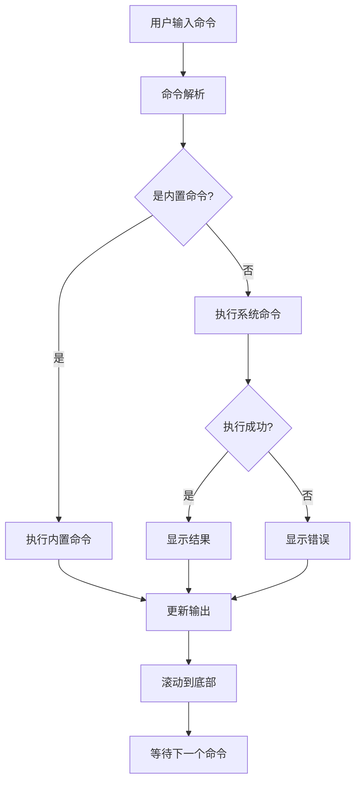

# 开发文档

## 架构设计

### 整体架构

```
┌─────────────────────────────────────┐
│            UI Layer                 │
│  ┌─────────────────────────────────┐│
│  │      TerminalScreen             ││
│  │  ┌─────────────┐ ┌─────────────┐││
│  │  │   Output    │ │    Input    │││
│  │  │   Display   │ │    Field    │││
│  │  └─────────────┘ └─────────────┘││
│  └─────────────────────────────────┘│
└─────────────────────────────────────┘
┌─────────────────────────────────────┐
│          Business Logic             │
│  ┌─────────────────────────────────┐│
│  │     Command Processor           ││
│  │  ┌─────────────┐ ┌─────────────┐││
│  │  │   Built-in  │ │   System    │││
│  │  │   Commands  │ │  Commands   │││
│  │  └─────────────┘ └─────────────┘││
│  └─────────────────────────────────┘│
└─────────────────────────────────────┘
┌─────────────────────────────────────┐
│          Data Layer                 │
│  ┌─────────────────────────────────┐│
│  │  ┌─────────────┐ ┌─────────────┐││
│  │  │   Settings  │ │   History   │││
│  │  │   Storage   │ │   Storage   │││
│  │  └─────────────┘ └─────────────┘││
│  └─────────────────────────────────┘│
└─────────────────────────────────────┘
```

### 核心组件

#### 1. TerminalScreen (主界面)
- **职责**: 管理终端界面和用户交互
- **主要功能**:
  - 显示命令输出
  - 处理用户输入
  - 管理界面状态
  - 处理键盘事件

#### 2. Command Processor (命令处理器)
- **职责**: 解析和执行命令
- **主要功能**:
  - 命令解析
  - 内置命令执行
  - 系统命令调用
  - 错误处理

#### 3. Settings Manager (设置管理器)
- **职责**: 管理应用配置
- **主要功能**:
  - 主题设置
  - 用户偏好存储
  - 配置持久化

## 详细实现

### 命令执行流程



### 内置命令实现

#### 文件系统命令

```dart
// ls 命令实现示例
Future<void> _listDirectory(List<String> args) async {
  try {
    final dir = args.isEmpty ? _currentDirectory : args[0];
    final directory = Directory(path.isAbsolute(dir) ? dir : path.join(_currentDirectory, dir));
    
    if (!await directory.exists()) {
      _output.add('目录不存在: $dir');
      return;
    }
    
    final entities = await directory.list().toList();
    entities.sort((a, b) => a.path.compareTo(b.path));
    
    for (final entity in entities) {
      final name = path.basename(entity.path);
      if (entity is Directory) {
        _output.add('📁 $name/');
      } else {
        final stat = await entity.stat();
        final size = _formatFileSize(stat.size);
        _output.add('📄 $name ($size)');
      }
    }
  } catch (e) {
    _output.add('错误: $e');
  }
}
```

#### 系统命令执行

```dart
Future<void> _executeSystemCommand(String command) async {
  try {
    final result = await _shell!.run(command);
    
    // 处理标准输出
    for (final line in result.outText.split('\n')) {
      if (line.isNotEmpty) _output.add(line);
    }
    
    // 处理错误输出
    if (result.errText.isNotEmpty) {
      for (final line in result.errText.split('\n')) {
        if (line.isNotEmpty) _output.add('Error: $line');
      }
    }
  } catch (e) {
    _output.add('命令未找到或执行失败: $command');
  }
}
```

### 状态管理

#### 应用状态
```dart
class TerminalState {
  List<String> output;           // 终端输出
  List<String> commandHistory;   // 命令历史
  String currentDirectory;       // 当前目录
  TerminalSettings settings;     // 终端设置
  
  // 状态更新方法
  void addOutput(String text) { /* ... */ }
  void addCommand(String command) { /* ... */ }
  void changeDirectory(String path) { /* ... */ }
}
```

#### 设置管理
```dart
class TerminalSettings {
  double fontSize;
  Color textColor;
  Color backgroundColor;
  
  // 序列化方法
  Map<String, dynamic> toJson() { /* ... */ }
  factory TerminalSettings.fromJson(Map<String, dynamic> json) { /* ... */ }
  
  // 持久化方法
  Future<void> save() async { /* ... */ }
  static Future<TerminalSettings> load() async { /* ... */ }
}
```

### 性能优化策略

#### 1. 输出缓冲区管理
```dart
class OutputBuffer {
  static const int maxLines = 1000;
  final List<String> _buffer = [];
  
  void add(String line) {
    _buffer.add(line);
    if (_buffer.length > maxLines) {
      _buffer.removeAt(0);
    }
  }
  
  List<String> get lines => List.unmodifiable(_buffer);
}
```

#### 2. 异步命令执行
```dart
Future<void> _executeCommandAsync(String command) async {
  // 显示执行中状态
  _output.add('执行中: $command');
  setState(() {});
  
  try {
    // 异步执行命令
    final result = await Future.microtask(() => _processCommand(command));
    
    // 更新结果
    _output.removeLast(); // 移除"执行中"消息
    _output.add('完成: $command');
  } catch (e) {
    _output.add('错误: $e');
  }
  
  setState(() {});
}
```

#### 3. 虚拟滚动
```dart
ListView.builder(
  controller: _scrollController,
  itemCount: _output.length,
  itemBuilder: (context, index) {
    // 只渲染可见的项目
    return _buildOutputLine(_output[index]);
  },
)
```

## 扩展开发

### 添加新的内置命令

1. **在命令处理器中添加新命令**:
```dart
Future<void> _processCommand(String command) async {
  final parts = command.split(' ');
  final cmd = parts[0].toLowerCase();
  final args = parts.length > 1 ? parts.sublist(1) : <String>[];
  
  switch (cmd) {
    // ... 现有命令
    case 'mynewcommand':
      await _handleMyNewCommand(args);
      break;
    // ...
  }
}
```

2. **实现命令处理方法**:
```dart
Future<void> _handleMyNewCommand(List<String> args) async {
  // 参数验证
  if (args.isEmpty) {
    _output.add('用法: mynewcommand <参数>');
    return;
  }
  
  try {
    // 命令逻辑实现
    final result = await performOperation(args[0]);
    _output.add('操作成功: $result');
  } catch (e) {
    _output.add('操作失败: $e');
  }
}
```

3. **更新帮助信息**:
```dart
void _showHelp() {
  _output.addAll([
    // ... 现有帮助信息
    '  mynewcommand <arg> - 我的新命令描述',
    // ...
  ]);
}
```

### 自定义主题系统

#### 主题数据结构
```dart
class TerminalTheme {
  final String name;
  final Color backgroundColor;
  final Color textColor;
  final Color promptColor;
  final Color errorColor;
  final double fontSize;
  final String fontFamily;
  
  const TerminalTheme({
    required this.name,
    required this.backgroundColor,
    required this.textColor,
    required this.promptColor,
    required this.errorColor,
    required this.fontSize,
    required this.fontFamily,
  });
  
  // 预定义主题
  static const TerminalTheme dark = TerminalTheme(
    name: 'Dark',
    backgroundColor: Colors.black,
    textColor: Colors.green,
    promptColor: Colors.yellow,
    errorColor: Colors.red,
    fontSize: 14.0,
    fontFamily: 'Courier',
  );
  
  static const TerminalTheme light = TerminalTheme(
    name: 'Light',
    backgroundColor: Colors.white,
    textColor: Colors.black,
    promptColor: Colors.blue,
    errorColor: Colors.red,
    fontSize: 14.0,
    fontFamily: 'Courier',
  );
}
```

#### 主题管理器
```dart
class ThemeManager {
  static const String _themeKey = 'terminal_theme';
  
  static Future<TerminalTheme> loadTheme() async {
    final prefs = await SharedPreferences.getInstance();
    final themeData = prefs.getString(_themeKey);
    
    if (themeData != null) {
      return TerminalTheme.fromJson(jsonDecode(themeData));
    }
    
    return TerminalTheme.dark; // 默认主题
  }
  
  static Future<void> saveTheme(TerminalTheme theme) async {
    final prefs = await SharedPreferences.getInstance();
    await prefs.setString(_themeKey, jsonEncode(theme.toJson()));
  }
}
```

### 插件系统设计

#### 插件接口
```dart
abstract class TerminalPlugin {
  String get name;
  String get version;
  List<String> get commands;
  
  Future<void> initialize();
  Future<String> executeCommand(String command, List<String> args);
  void dispose();
}
```

#### 插件管理器
```dart
class PluginManager {
  final Map<String, TerminalPlugin> _plugins = {};
  
  void registerPlugin(TerminalPlugin plugin) {
    _plugins[plugin.name] = plugin;
  }
  
  Future<String?> executePluginCommand(String command, List<String> args) async {
    for (final plugin in _plugins.values) {
      if (plugin.commands.contains(command)) {
        return await plugin.executeCommand(command, args);
      }
    }
    return null;
  }
  
  List<TerminalPlugin> get plugins => _plugins.values.toList();
}
```

#### 示例插件
```dart
class GitPlugin extends TerminalPlugin {
  @override
  String get name => 'Git Plugin';
  
  @override
  String get version => '1.0.0';
  
  @override
  List<String> get commands => ['gstatus', 'gadd', 'gcommit'];
  
  @override
  Future<void> initialize() async {
    // 插件初始化逻辑
  }
  
  @override
  Future<String> executeCommand(String command, List<String> args) async {
    switch (command) {
      case 'gstatus':
        return await _getGitStatus();
      case 'gadd':
        return await _gitAdd(args);
      case 'gcommit':
        return await _gitCommit(args);
      default:
        throw UnimplementedError('Command $command not implemented');
    }
  }
  
  Future<String> _getGitStatus() async {
    // Git status 实现
    final result = await Process.run('git', ['status', '--porcelain']);
    return result.stdout.toString();
  }
  
  // ... 其他 Git 命令实现
  
  @override
  void dispose() {
    // 清理资源
  }
}
```

## 测试策略

### 单元测试

#### 命令处理器测试
```dart
import 'package:flutter_test/flutter_test.dart';

void main() {
  group('Command Processor Tests', () {
    late TerminalScreen terminal;
    
    setUp(() {
      terminal = TerminalScreen();
    });
    
    test('should execute ls command', () async {
      await terminal.processCommand('ls');
      expect(terminal.output, contains('📁'));
    });
    
    test('should handle invalid command', () async {
      await terminal.processCommand('invalidcommand');
      expect(terminal.output, contains('命令未找到'));
    });
    
    test('should change directory', () async {
      await terminal.processCommand('cd ..');
      expect(terminal.currentDirectory, isNot(equals(terminal.initialDirectory)));
    });
  });
}
```

#### 设置管理测试
```dart
group('Settings Tests', () {
  test('should save and load settings', () async {
    final settings = TerminalSettings(
      fontSize: 16.0,
      textColor: Colors.blue,
      backgroundColor: Colors.white,
    );
    
    await settings.save();
    final loadedSettings = await TerminalSettings.load();
    
    expect(loadedSettings.fontSize, equals(16.0));
    expect(loadedSettings.textColor, equals(Colors.blue));
  });
});
```

### 集成测试

#### 界面交互测试
```dart
import 'package:flutter/services.dart';
import 'package:flutter_test/flutter_test.dart';
import 'package:integration_test/integration_test.dart';

void main() {
  IntegrationTestWidgetsFlutterBinding.ensureInitialized();
  
  group('Terminal Integration Tests', () {
    testWidgets('should execute command and show output', (tester) async {
      await tester.pumpWidget(TerminalApp());
      
      // 输入命令
      await tester.enterText(find.byType(TextField), 'pwd');
      await tester.testTextInput.receiveAction(TextInputAction.done);
      await tester.pump();
      
      // 验证输出
      expect(find.textContaining('/'), findsOneWidget);
    });
    
    testWidgets('should navigate command history', (tester) async {
      await tester.pumpWidget(TerminalApp());
      
      // 输入第一个命令
      await tester.enterText(find.byType(TextField), 'pwd');
      await tester.testTextInput.receiveAction(TextInputAction.done);
      await tester.pump();
      
      // 输入第二个命令
      await tester.enterText(find.byType(TextField), 'ls');
      await tester.testTextInput.receiveAction(TextInputAction.done);
      await tester.pump();
      
      // 使用上箭头键
      await tester.sendKeyEvent(LogicalKeyboardKey.arrowUp);
      await tester.pump();
      
      // 验证历史命令
      expect(find.text('ls'), findsOneWidget);
    });
  });
}
```

### 性能测试

#### 内存使用测试
```dart
test('should not exceed memory limit with large output', () async {
  final terminal = TerminalScreen();
  
  // 生成大量输出
  for (int i = 0; i < 10000; i++) {
    terminal.addOutput('Line $i');
  }
  
  // 验证内存使用在合理范围内
  expect(terminal.output.length, lessThanOrEqualTo(1000));
});
```

#### 响应时间测试
```dart
test('should execute commands within acceptable time', () async {
  final terminal = TerminalScreen();
  final stopwatch = Stopwatch()..start();
  
  await terminal.processCommand('pwd');
  
  stopwatch.stop();
  expect(stopwatch.elapsedMilliseconds, lessThan(100));
});
```

## 部署指南

### 构建配置

#### Android
```bash
# 构建 APK
flutter build apk --release

# 构建 App Bundle
flutter build appbundle --release
```

#### iOS
```bash
# 构建 iOS 应用
flutter build ios --release
```

#### Desktop
```bash
# Windows
flutter build windows --release

# macOS
flutter build macos --release

# Linux
flutter build linux --release
```

### 发布清单

- [ ] 更新版本号 (pubspec.yaml)
- [ ] 更新变更日志 (CHANGELOG.md)
- [ ] 运行所有测试
- [ ] 构建发布版本
- [ ] 测试发布版本
- [ ] 创建 Git 标签
- [ ] 发布到应用商店

### 持续集成

#### GitHub Actions 配置
```yaml
name: CI/CD

on:
  push:
    branches: [ main ]
  pull_request:
    branches: [ main ]

jobs:
  test:
    runs-on: ubuntu-latest
    steps:
    - uses: actions/checkout@v2
    - uses: subosito/flutter-action@v2
      with:
        flutter-version: '3.10.1'
    - run: flutter pub get
    - run: flutter test
    - run: flutter build apk --debug

  build:
    needs: test
    runs-on: ubuntu-latest
    if: github.ref == 'refs/heads/main'
    steps:
    - uses: actions/checkout@v2
    - uses: subosito/flutter-action@v2
      with:
        flutter-version: '3.10.1'
    - run: flutter pub get
    - run: flutter build apk --release
    - uses: actions/upload-artifact@v2
      with:
        name: release-apk
        path: build/app/outputs/flutter-apk/app-release.apk
```

## 故障排除

### 常见开发问题

#### 1. 依赖冲突
```bash
# 清理依赖
flutter clean
flutter pub get

# 升级依赖
flutter pub upgrade
```

#### 2. 平台特定问题
```bash
# Android
flutter doctor --android-licenses

# iOS
pod install --repo-update

# Desktop
flutter config --enable-windows-desktop
```

#### 3. 性能问题
- 使用 Flutter Inspector 分析 Widget 树
- 使用 Performance 面板监控性能
- 检查内存泄漏

### 调试技巧

#### 1. 日志记录
```dart
import 'dart:developer' as developer;

void debugLog(String message) {
  developer.log(message, name: 'Terminal');
}
```

#### 2. 断点调试
- 在 IDE 中设置断点
- 使用 `debugger()` 语句
- 检查变量状态

#### 3. 性能分析
```bash
# 启动性能分析
flutter run --profile

# 在 DevTools 中查看性能数据
```

---

这份开发文档提供了完整的技术实现细节和扩展指南，帮助开发者理解和扩展终端模拟器的功能。